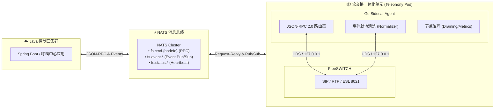

# FreeSWITCH Go Sidecar Agent (Telephony Pod Gateway)

[](https://golang.org)
[](https://nats.io)
[](https://www.jsonrpc.org/specification)
[](https://freeswitch.org)

## 📖 项目简介

`chandler25-fs-sidecar-agent` 是面向**云原生与集群化部署**设计的高性能软交换守护网关（Telephony Pod Sidecar）。

它与 **FreeSWITCH** 作为**「软交换一体化单元（Telephony Pod）」**伴生运行：
1. **彻底解耦**：控制面（Java 微服务）与媒体面（FreeSWITCH）完全解耦，消除 $M \times N$ 网状长连接；
2. **就地降噪与高吞吐**：在本地过滤 90% 的冗余 ESL 内部事件，仅向上游 NATS 广播标准化业务事件；
3. **极简对接**：底层生涩的 ESL 文本命令被全面封装为标准 **JSON-RPC 2.0** 接口，屏蔽变量陷阱与转义；
4. **集群治理能力**：内置节点假死探活（Watchdog）、容量限制（Overload Protection）与无损滚动升级（Call Draining）。

---

## 🏛️ 整体架构



---

## 📂 项目结构

```text
chandler25-fs-sidecar-agent/
├── main.go                       # 应用程序入口与信号优雅退出
├── config/
│   └── config.go                 # 环境变量配置管理
├── esl/
│   └── client.go                 # 纯 Go 高性能 Inbound ESL 客户端 (支持自动断线指数重连)
├── event/
│   └── normalizer.go             # 原始 ESL 事件到标准 JSON 归一化清洗器
├── governance/
│   └── node.go                   # 节点生命周期、并发限流、Call Draining 治理
├── nats/
│   └── client.go                 # NATS 连接管理、RPC 监听与事件/心跳发布
├── rpc/
│   ├── types.go                  # JSON-RPC 2.0 规范报文与呼叫中心专有错误码
│   ├── handler.go                # RPC 调度器与路由器
│   └── methods.go                # 核心呼叫控制方法实现 (originate, bridge, hangup, transfer 等)
├── test/
│   └── nats_client_demo.go       # 客户端测试与实时事件监听工具
├── docker-compose.yml            # 本地 NATS 服务一键编排
└── README.md
```

---

## 🚀 快速启动指南

### 1. 启动本地 NATS 消息总线
通过 Docker Compose 启动带 Web 监控大盘的 NATS 实例：
```bash
docker compose up -d
```
> Web 监控界面访问地址：http://localhost:8222

### 2. 编译并启动 Go Sidecar Agent
```bash
# 编译二进制包 (体积仅约 9.4MB)
go build -o fs-agent main.go

# 启动 (使用默认配置：NodeID=本机主机名, NATS=127.0.0.1:4222, FS=127.0.0.1:8021)
./fs-agent
```

若需自定义环境变量：
```bash
NODE_ID=telephony-pod-01 NATS_URL=nats://127.0.0.1:4222 FS_ESL_ADDR=127.0.0.1:8021 ./fs-agent
```

---

## 🧪 客户端联调与测试

我们内置了 `test/nats_client_demo.go` 模拟客户端工具：

### 1. 查看节点运行状态与容量快照
```bash
go run test/nats_client_demo.go -cmd status
```
**收到响应**：
```json
{
  "activeChannels": 0,
  "maxChannels": 1000,
  "nodeId": "telephony-pod-01",
  "state": "HEALTHY",
  "timestamp": 1789624500123,
  "uptimeSeconds": 15
}
```

### 2. 模拟灰度下线（开启 Call Draining 沥干模式）
```bash
go run test/nats_client_demo.go -cmd drain
```
节点进入 `DRAINING` 状态，后续任何新外呼将被拒绝（返回 `-32006 Node is draining`），存量通话不受影响。

### 3. 恢复接单
```bash
go run test/nats_client_demo.go -cmd resume
```

### 4. 实时监听全集群事件流与心跳
```bash
go run test/nats_client_demo.go -cmd listen
```
当 FreeSWITCH 发生任何呼叫、接听、按键时，终端将实时打印清洗后的纯净 JSON 事件：
```json
{
  "eventId": "evt-b8f2a193",
  "nodeId": "telephony-pod-01",
  "timestamp": 1789624510045,
  "eventType": "CALL_ANSWERED",
  "bizId": "bridge-xxx",
  "channelUuid": "2a80d369-c66f-4200-9fb9-b31dfd4e1bad",
  "role": "caller",
  "extension": "1007",
  "data": {
    "sipCode": "200"
  }
}
```

---

## 📡 JSON-RPC 2.0 接口规范清单

发往 Subject：`fs.cmd.{nodeId}`

| 方法 Method | 功能说明 | 关键入参 |
| :--- | :--- | :--- |
| `call.originate` | 外呼单端分机入 Park | `extension`, `uuid`, `bizId`, `role`, `timeoutSeconds`, `parkAfterBridge`, `hangupAfterBridge` |
| `call.bridge` | 双端通话强制桥接 | `uuidA`, `uuidB` |
| `call.hangup` | 主动挂机 | `uuid`, `cause` (默认 `NORMAL_CLEARING`) |
| `call.transfer` | 盲转或转入指定应用 | `uuid`, `destination`, `inline` (布尔值) |
| `call.transferToConference` | 动态加入三方会议室 | `uuid`, `conferenceName`, `profile` (默认 `default`) |
| `call.playAndGetDigits` | 满意度评价放音并收号 | `uuid`, `audioFile`, `minDigits`, `maxDigits`, `timeoutMs`, `regex` |
| `call.recordStart` | 开启双向通话录音 | `uuid`, `filePath` |
| `call.recordStop` | 停止通话录音 | `uuid`, `filePath` |
| `node.drain` | 节点优雅下线（沥干） | 无 |
| `node.resume` | 节点恢复接入 | 无 |
| `node.status` | 查询节点状态与通道数 | 无 |
