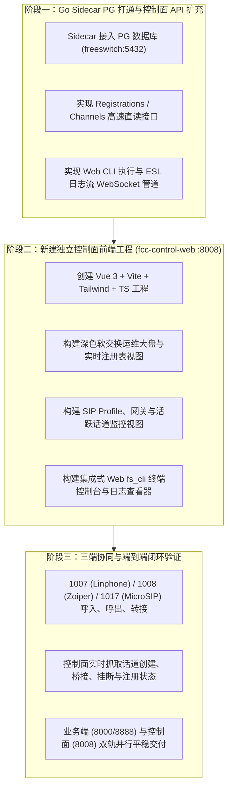

# FreeSWITCH 软交换控制面与 Go Sidecar 架构设计规范 (Telephony Control Plane Design)

## 一、架构背景与设计愿景 (Background & Vision)

在现代高可用呼叫中心 (FCC / PBX) 体系中，必须严格区分**业务管理面 (Business Plane)** 与 **话务软交换控制面 (Telephony Control Plane)** 两大职责边界：

```
                    ┌─────────────────────────────────────────────────────────┐
                    │               业务运营人员 / 客服代表 / 班长            │
                    └────────────────────────────┬────────────────────────────┘
                                                 │
                                                 ▼
      ┌─────────────────────────────────────────────────────────────────────────────────────┐
      │  【业务管理端 & 坐席工作台】(fcc-admin-web :8000 / fcc-client-web :8888)            │
      │  · 坐席人员准入与 9 人法定白名单      · 组织架构与技能组话务策略 (LONGEST_IDLE/轮询)   │
      │  · 坐席三种接听策略 (软话机/话机/手机) · 业务客户话单与工单流转 (Call Records)        │
      │  · 来电弹屏与话后小结 (ACW)           · 班长业务监管 (监听/耳语/强插/强拆)            │
      └──────────────────────────────────────────┬──────────────────────────────────────────┘
                                                 │ 业务鉴权与调度
                                                 ▼
      ┌─────────────────────────────────────────────────────────────────────────────────────┐
      │  【话务软交换控制面前端】(chandler26-fcc-control-web :8008，对标 XSwitch)            │
      │  · FreeSWITCH 节点与引擎健康度大盘   · 实时 SIP 注册表 (Contact/IP/UA/NAT/Ping/租期)│
      │  · SIP 档案管理 (Internal / External) · 运营商 SIP 网关与中继 (Trunk UP/DOWN)         │
      │  · 活跃话道与媒体流实时墙 (Channels)  · 软交换底层原始 CDR (SIP Code / Q.850 / 抖动)  │
      │  · 模块与事件配置 (如 XCC/ESL)        · Web 交互终端 (在线执行 fs_cli 与日志流追踪)   │
      └──────────────────────────────────────────┬──────────────────────────────────────────┘
                                                 │ HTTP / WebSocket (:8088)
                                                 ▼
      ┌─────────────────────────────────────────────────────────────────────────────────────┐
      │  【软交换守护网关】Go Sidecar Agent (chandler25-fs-sidecar-agent)                   │
      │  · 纯 Go Inbound ESL 客户端           · NATS + JSON-RPC 2.0 消息总线客户端          │
      │  · PostgreSQL 数据库原生连接池        · 控制面 RESTful API 与 ESL 日志 WebSocket 网关│
      │  · 节点熔断保护与 Call Draining 治理  · XML 静态目录写入与动态 reloadxml 同步        │
      └────────────────────────────┬─────────────────────────────┬──────────────────────────┘
                                   │ ESL 8021                    │ SQL
                                   ▼                             ▼
                     ┌───────────────────────────┐ ┌───────────────────────────┐
                     │ FreeSWITCH 核心软交换引擎 │ │  PostgreSQL 核心数据库    │
                     │ (mod_sofia, core-db, RTP) │ │  (freeswitch:5432)        │
                     └───────────────────────────┘ └───────────────────────────┘
```

### 核心解耦设计原则
1. **业务系统与通信底层解耦**：`fcc-admin-web` 专心治理坐席、组织、业务工单，不直接侵入 SIP 报文、NAT 穿透、RTP 编解码和 ESL 命令细节。
2. **纯原生通信观测平台**：新建独立的控制面前端 `chandler26-fcc-control-web`，面向通信工程师与运维人员，对标商业化 XSwitch 控制台，直接穿透到底层 FreeSWITCH 的 SIP 会话、网关、话道与注册表。
3. **数据统一落地 PostgreSQL**：FreeSWITCH 内部原生运行态（Registrations, Channels, Calls, NAT）全部挂载并持久化到本地 PostgreSQL (`freeswitch:5432`)。Go Sidecar 同样直连该 PG 数据库，实现毫秒级数据读取与结构化聚合，彻底消灭生涩复杂的文本行解析开销。

---

## 二、PostgreSQL 软交换数据模型设计 (Database Architecture)

FreeSWITCH 已启用 PostgreSQL 作为 Core Database（通过 `core-db-dsn` / `mod_pgsql` 支持）。Go Sidecar 直接复用并增强该数据库体系。

### 1. FreeSWITCH 原生表（实时由 FreeSWITCH 写入维护）

| 原生数据表 | 核心字段定义 | 业务用途与控制面映射 |
| :--- | :--- | :--- |
| **`registrations`** | `reg_user`, `realm`, `token`, `url`, `expires`, `network_ip`, `network_port`, `network_proto`, `hostname`, `metadata` | **实时分机注册表**：监控分机 `1007`, `1008`, `1017`, `901001` 等在线状态、远端真实 IP:Port、NAT 状态、过期倒计时。 |
| **`channels`** | `uuid`, `direction`, `created`, `created_epoch`, `name`, `state`, `cid_name`, `cid_num`, `ip_addr`, `dest`, `application`, `dialplan`, `context`, `read_codec`, `write_codec`, `callstate`, `callee_name`, `callee_num`, `call_uuid`, `hostname` | **并发活跃话道表**：追踪系统当前所有呼入、呼出、转接中的单个 Channel 状态、读写编解码器与主被叫。 |
| **`calls`** | `call_uuid`, `call_created`, `call_created_epoch`, `caller_uuid`, `callee_uuid`, `hostname` | **双向通话会话表**：记录两端话道（Leg A 与 Leg B）的 Bridge 桥接对齐关系。 |
| **`nat`** | `port`, `proto`, `ip_addr`, `hostname` | **NAT 穿透映射表**：UPnP 与 Pinhole 端口探测数据。 |
| **`tasks`** | `task_id`, `task_desc`, `task_group`, `task_sql_manager`, `hostname` | **FreeSWITCH 定时任务队列**。 |

### 2. 控制面增强扩展表（由 Go Sidecar 维护管理）

为了实现类似 XSwitch 的网关维护、模块状态与配置热加载，Go Sidecar 在 PG `freeswitch` 库中补充以下元数据表：

```sql
-- 1. SIP Profile 网络与安全配置表
CREATE TABLE IF NOT EXISTS fs_sip_profile (
    id SERIAL PRIMARY KEY,
    profile_name VARCHAR(64) UNIQUE NOT NULL,      -- internal, external
    sip_port INT NOT NULL DEFAULT 5060,
    tls_port INT DEFAULT 5061,
    wss_port INT DEFAULT 7443,
    bind_ip VARCHAR(64) NOT NULL DEFAULT '0.0.0.0',
    ext_sip_ip VARCHAR(64),                        -- 公网映射 IP
    ext_rtp_ip VARCHAR(64),
    rtp_ip VARCHAR(64) NOT NULL DEFAULT '0.0.0.0',
    codecs VARCHAR(256) NOT NULL DEFAULT 'PCMA,PCMU,OPUS,G729',
    status VARCHAR(32) NOT NULL DEFAULT 'RUNNING',  -- RUNNING, STOPPED
    updated_at TIMESTAMP DEFAULT CURRENT_TIMESTAMP
);

-- 2. 运营商网关 / SIP 中继表
CREATE TABLE IF NOT EXISTS fs_gateway (
    id SERIAL PRIMARY KEY,
    profile_id VARCHAR(64) NOT NULL DEFAULT 'external',
    gateway_name VARCHAR(64) UNIQUE NOT NULL,      -- 如 trunk_unicom_01
    username VARCHAR(128),
    auth_realm VARCHAR(128),
    proxy_ip VARCHAR(128) NOT NULL,
    register_enabled BOOLEAN DEFAULT TRUE,
    register_status VARCHAR(32) DEFAULT 'NOREG',   -- UP, DOWN, REGED, FAILED
    ping_freq_seconds INT DEFAULT 30,
    ping_status VARCHAR(32) DEFAULT 'REACHABLE',
    created_at TIMESTAMP DEFAULT CURRENT_TIMESTAMP,
    updated_at TIMESTAMP DEFAULT CURRENT_TIMESTAMP
);

-- 3. 软交换底层原始全量 CDR 话单表
CREATE TABLE IF NOT EXISTS fs_cdr (
    id BIGSERIAL PRIMARY KEY,
    call_uuid VARCHAR(128) UNIQUE NOT NULL,
    caller_uuid VARCHAR(128),
    callee_uuid VARCHAR(128),
    caller_number VARCHAR(64) NOT NULL,
    callee_number VARCHAR(64) NOT NULL,
    direction VARCHAR(16) NOT NULL,                -- INBOUND, OUTBOUND, INTERNAL
    profile_name VARCHAR(64),
    gateway_name VARCHAR(64),
    sip_call_id VARCHAR(256),
    sip_hangup_disposition VARCHAR(64),            -- send_bye, recv_bye, etc.
    sip_hangup_code INT,                           -- 200, 486, 487, 503
    hangup_cause VARCHAR(64),                      -- NORMAL_CLEARING, USER_BUSY
    start_time TIMESTAMP NOT NULL,
    answer_time TIMESTAMP,
    end_time TIMESTAMP NOT NULL,
    duration_seconds INT DEFAULT 0,
    billsec_seconds INT DEFAULT 0,
    read_codec VARCHAR(32),
    write_codec VARCHAR(32),
    quality_jitter_in_ms DOUBLE PRECISION DEFAULT 0.0,
    quality_loss_percent DOUBLE PRECISION DEFAULT 0.0,
    raw_variables JSONB,                           -- 全量信令与通道变量快照
    created_at TIMESTAMP DEFAULT CURRENT_TIMESTAMP
);
CREATE INDEX IF NOT EXISTS idx_fs_cdr_caller ON fs_cdr (caller_number);
CREATE INDEX IF NOT EXISTS idx_fs_cdr_callee ON fs_cdr (callee_number);
CREATE INDEX IF NOT EXISTS idx_fs_cdr_start_time ON fs_cdr (start_time);
```

---

## 三、Go Sidecar (`chandler25-fs-sidecar-agent`) 架构演进

当前 Go Sidecar 已经完成了 ESL 监听、事件清洗与 NATS 转发基础。为了支撑控制面前端，我们将对 Sidecar 进行如下三项扩展：

```
chandler25-fs-sidecar-agent/
├── main.go                       # 入口：加载配置、初始化 PG、ESL、NATS 与 HTTP
├── config/
│   └── config.go                 # 增加 PG 连接串环境变量 (PG_DSN)
├── db/                           # [新增] PostgreSQL 数据库连接池与查询层
│   ├── client.go                 # GORM / pgx 连接池与健康检测
│   ├── model.go                  # Registration, Channel, Call, Gateway 实体映射
│   └── repo.go                   # 针对 registrations 与 channels 的高性能检索
├── esl/
│   ├── client.go                 # ESL 命令执行与重连
│   └── cli_stream.go             # [新增] fs_cli 控制台命令执行与实时日志流抓取
├── api/
│   ├── server.go                 # HTTP 服务器 (运行于 :8088)
│   ├── handler_extension.go      # 分机 XML 开户/销户
│   ├── handler_telephony.go      # [新增] 控制面监控 API (读 PG + 读 ESL)
│   ├── handler_gateway.go        # [新增] 网关查询与控制 API
│   ├── handler_cli.go            # [新增] 在线 fs_cli 指令执行 API
│   └── ws_logs.go                # [新增] WebSocket 实时 FreeSWITCH 日志信道
```

### 核心接口设计 (RESTful & WebSocket on `:8088`)

#### 1. 软交换健康与引擎大盘
* **`GET /api/v1/telephony/status`**：
  * 返回 FreeSWITCH 版本、运行时间 (Uptime)、当前总 Session 数、实时 CPS、最大并发配置；
  * 底层命令：执行 ESL `status` 并提取指标，配合 PG `COUNT(*) FROM channels`。

#### 2. 实时分机与注册表 (Direct from PostgreSQL)
* **`GET /api/v1/telephony/registrations`**：
  * 参数：`user`, `ip`, `page`, `pageSize`
  * 数据源：直接 `SELECT * FROM registrations ORDER BY expires DESC`；
  * 补充 User-Agent 分析：通过匹配 Contact 中的特征（Linphone, Zoiper, MicroSIP, WebRTC/Verto）。
* **`POST /api/v1/telephony/registrations/flush`**：
  * 强制踢掉某个分机注册：ESL 执行 `sofia profile internal flush_inbound_reg <user>@<realm>`。

#### 3. 活跃话道与通话控制 (PG + ESL)
* **`GET /api/v1/telephony/channels`**：
  * 数据源：`SELECT * FROM channels` 关联 `calls`；
  * 字段：Channel UUID、主叫、被叫、当前状态、编解码、双向 Peer 话道 UUID。
* **`POST /api/v1/telephony/channels/kill`**：
  * 挂断指定话道：ESL `uuid_kill <uuid> NORMAL_CLEARING`。
* **`POST /api/v1/telephony/channels/transfer`**：
  * 转通话道：ESL `uuid_transfer <uuid> <target_ext> XML default`。

#### 4. SIP Profile 与运营商网关
* **`GET /api/v1/telephony/sofia/profiles`**：
  * 获取 `internal` 和 `external` 的监听端口、当前注册人数、编解码列表。
* **`GET /api/v1/telephony/gateways`**：
  * 运营商网关状态（ESL `sofia status gateway <name>` 回显解析）。
* **`POST /api/v1/telephony/gateways/rescan`**：
  * 热重载网关：ESL `sofia profile external rescan`。

#### 5. Web 终端沙箱与日志信道 (Web CLI)
* **`POST /api/v1/telephony/cli/exec`**：
  * 入参：`{"command": "show channels as json"}`
  * 执行并在响应中原样返回 FreeSWITCH 终端原始输出。
* **`WS /api/v1/telephony/ws/console-logs`**：
  * WebSocket 长连接，订阅 FreeSWITCH `log <level>`，将带颜色高亮的实时日志推送到控制面前端。

---

## 四、独立控制面前端工程设计 (`chandler26-fcc-control-web`)

### 1. 技术栈与工程规范
* **框架**：Vue 3 + Vite 6 + TypeScript + Pinia
* **样式风格**：深色工业极客风 (Cyber Dark Telephony Theme, `#0A0E17` 底色，霓虹蓝 `#3B82F6` 与翡翠绿 `#10B981` 状态色)
* **默认部署端口**：`8008` (与业务端 `:8000` / `:8888` 彻底隔开)

### 2. 页面与功能结构规划 (对标 XSwitch)

```
chandler26-fcc-control-web/ (Port: 8008)
├── 顶部导航栏 (Navbar)
│   ├── FreeSWITCH 集群节点切换器 (如: node-01 [192.168.18.64])
│   ├── 核心指标走字屏: Uptime 7d 12h | 会话数: 3 | 注册数: 3 | CPS: 0.2
│   └── 快速操作: [重载XML] [刷新Profile] [重启Sofia]
│
├── 左侧控制大类 (Sidebar)
│   ├── 📊 节点态势大盘 (Dashboard Overview)
│   │   ├── CPU / 内存 / Session 水位仪表盘
│   │   └── NATS 消息速率与 Sidecar 健康卡
│   │
│   ├── 📞 分机与注册中心 (Registrations)
│   │   ├── 实时在线注册表 (Linphone 1007, Zoiper 1008, MicroSIP 1017)
│   │   ├── Contact URI, IP:Port, NAT 穿透标记, Ping 延迟
│   │   └── 快速动作: 强制注销 / 拨号测试
│   │
│   ├── 🌐 SIP Profile 与网关 (SIP & Gateways)
│   │   ├── Profile 详情: internal (:5060, :7443) / external (:5080)
│   │   ├── 运营商 SIP Trunk 列表与探活心跳 (UP / DOWN)
│   │   └── 编解码协商优先级配置 (OPUS > PCMA > PCMU > G729)
│   │
│   ├── ⚡ 实时并发话道 (Active Channels & Calls)
│   │   ├── 正在通话通道列表 (Channel UUID, Caller, Callee, Callstate)
│   │   ├── 双向桥接关系图 (Leg A <---> Leg B)
│   │   └── 话务应急控制面板: [强拆挂断] [转接] [监听] [临时录音]
│   │
│   ├── 📑 软交换原始 CDR (Raw Call Detail Records)
│   │   ├── SIP 信令追踪 (SIP 200/486/487/503) 与 Q.850 清除码
│   │   └── RTP 质量指标分析 (Jitter, Packet Loss, 丢包抖动)
│   │
│   └── 💻 FreeSWITCH 终端沙箱 (Web CLI & Logs)
│       ├── 网页版 fs_cli (输入命令、即时回显)
│       └── 实时色彩日志流 (可根据 DEBUG/INFO/NOTICE/WARNING/ERR 实时过滤)
```

---

## 五、分阶段实施路线图 (Implementation Roadmap)



本设计确立了呼叫中心平台“业务”与“控制”双轨协同的终局架构，使系统既具备企业级业务灵活性，又拥有运营商级软交换的可观测性与操控力。
