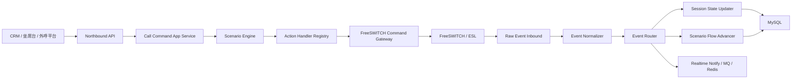

# 通话控制器增强版设计稿

## 1. 文档定位

本文档基于当前仓库的初版改造方案，并结合企业级呼叫中心控制器项目的成熟经验，形成一版更贴近生产落地的“增强版设计稿”。

相对初版文档，本版重点增强以下能力：

- 从“命令 + 状态”升级为“流程编排 + 动作处理器 + 事件驱动”
- 从单一用户状态表升级为“会话主记录 + 分腿记录 + 命令记录 + 事件记录”
- 从简单监听器升级为“原始事件接入 -> 事件归一化 -> 业务分流 -> 流程推进”
- 从 demo 风格控制接口升级为“北向 API / 控制内核 / 媒体交换适配器”分层

## 2. 参考经验摘要

参考的企业级控制器项目已经验证了几个关键事实：

- 通话控制器最终会演进成多模块系统，而不是单体 Controller 集合
- 一通呼叫不能只用一条记录表达，必须拆成主会话和多个参与腿
- 事件监听器不能承担全部业务逻辑，复杂规则需要下沉到 handler 或 flow
- 不同通话场景必须显式建模，例如呼入、外呼、内线、转接、自动外呼
- 底层控制动作必须收口，否则桥接、转接、录音等逻辑会快速失控

这些结论都已经在企业级项目中体现出来：

- 流程编排集中在 `flow` 包
- 底层控制动作集中在 `handler/xcc`
- 事件监听按类型和角色拆分
- 通话记录和坐席分腿记录分开建模

## 3. 与初版设计稿的关系

初版文档解决的是“从 demo 走向控制器”的基本骨架。

本版文档在此基础上增加：

- 业务场景模型
- 流程阶段模型
- 动作处理器模型
- 通话主记录和参与方记录的职责划分
- 更细的事件分发和控制编排建议

建议两个文档配合使用：

- 初版偏骨架和建设顺序
- 本版偏控制内核设计

## 4. 推荐目标形态

建议将当前项目的最终形态定义为：

“面向呼入、外呼、内线、转接、录音控制的企业级通话控制器”

其核心职责如下：

- 对外提供统一控制 API
- 为每一通电话维护完整生命周期
- 对不同通话模型执行不同流程
- 统一编排 FreeSWITCH/ESL 动作
- 维护实时状态与历史审计
- 支撑后续监控、报表、坐席协同和多节点扩展

## 5. 演进原则

### 5.1 先稳定控制内核，再扩展业务场景

不要一开始追求“所有呼叫中心能力齐全”，而要先做稳定的控制闭环：

- 命令受理
- 会话创建
- 事件回补
- 状态推进
- 结束归档

### 5.2 先抽象中性模型，再承接坐席业务

当前仓库应优先采用中性命名：

- `CallSession`
- `CallParticipant`
- `CallCommand`
- `CallEventLog`

而不是过早绑定为：

- `RouteRecord`
- `CallAgent`
- `AgentAnswerStatus`

这样后续既能做呼叫中心，也能做纯通话控制平台。

### 5.3 先轻量流程编排，再升级为强配置流程引擎

企业级项目已经有 `FlowConfig + FlowNode + ActionType` 模式，这很值得借鉴，但当前仓库首期不必直接做成完整 DSL。

建议按两步走：

- 第一步：代码内置流程模型
- 第二步：再逐步开放配置化节点

## 6. 增强版总体架构



## 7. 建议模块划分

参考企业级项目经验，建议当前仓库后续演进为以下模块。

### 7.1 当前阶段可先保留单仓多包

```text
src/main/java/com/chandler/freeswitch/client/example
  /call
    /api
    /app
    /domain
    /infra
    /scenario
    /handler
    /listener
  /agent
  /gateway
  /shared
```

### 7.2 后续可拆分为多模块

建议的中长期模块：

- `call-controller-common`
- `call-controller-core`
- `call-controller-web`
- `call-controller-admin-core`
- `call-controller-admin-web`
- `call-controller-starter`

这个方向与企业级项目的模块化形态一致，但当前仓库不需要首期就拆。

## 8. 三层核心模型

增强版设计里，建议把模型拆成三层。

### 8.1 会话主模型

表示“一通电话”。

建议实体：`CallSession`

职责：

- 表达一通呼叫的业务身份
- 记录整体状态
- 记录主叫被叫和业务场景
- 记录接通、桥接、结束等关键时间点

建议字段：

- `sessionId`
- `bizId`
- `requestId`
- `scenarioKey`
- `direction`
- `callerNumber`
- `destinationNumber`
- `state`
- `bridgeState`
- `recordState`
- `ctrlNodeId`
- `fsNodeId`
- `answerTime`
- `bridgeTime`
- `endTime`
- `hangupReason`
- `hangupCause`

### 8.2 参与方/分腿模型

表示“这通电话中的某个参与方和其 leg”。

建议实体：`CallParticipant`

相比初版 `CallLeg`，本版建议实体语义更宽一点，因为后面不仅有 A/B leg，还有：

- 坐席腿
- 客户腿
- 转接腿
- 第三方腿

建议字段：

- `participantId`
- `sessionId`
- `role`
- `sortNo`
- `channelUuid`
- `otherChannelUuid`
- `identityType`
- `identityValue`
- `deviceType`
- `deviceValue`
- `legState`
- `ringingTime`
- `answerTime`
- `hangupTime`
- `hangupCause`
- `hangupReason`
- `fromParticipantId`

角色建议：

- `CALLER`
- `CALLEE`
- `AGENT`
- `CUSTOMER`
- `TRANSFER_TARGET`
- `THIRD_PARTY`

### 8.3 控制与审计模型

建议实体：

- `CallCommand`
- `CallEventLog`
- `CallTimeline`

职责分别是：

- `CallCommand`：记录每次北向命令
- `CallEventLog`：保留底层原始事件
- `CallTimeline`：记录业务可读时间线

## 9. 业务场景模型

企业级项目最值得借鉴的一点，是显式区分“通话场景”。

建议当前仓库定义 `ScenarioKey`：

- `CALL_IN`
- `CALL_IN_DIRECT`
- `DIAL_OUT`
- `INTERNAL_CALL`
- `INTERNAL_DIAL`
- `EXTERNAL_CALL`
- `DOUBLE_CALL`
- `ATTENDED_TRANSFER`
- `AUTO_DIAL`

原因很简单：

- 同样是 `ANSWERED` 事件，在呼入场景和外呼场景的意义不同
- 同样是 `DESTROY/HANGUP`，在转接场景和普通通话里的补偿逻辑不同
- 如果不先区分场景，后面 listener 会越来越臃肿

## 10. 流程编排模型

### 10.1 为什么要引入流程阶段

单纯的状态机解决的是“现在处于什么状态”。

但企业级控制器还需要回答：

- 下一步应该执行什么动作
- 哪些动作属于该场景
- 哪些动作在应答前执行，哪些在接通后执行

所以建议引入轻量流程编排模型。

### 10.2 推荐阶段

建议定义统一的 `CallStage`：

- `INIT`
- `START`
- `ROUTE`
- `CONNECTED`
- `CALLING`
- `NORMAL_END`
- `ERROR_END`
- `END`

这套阶段命名明显受到企业级项目 `FlowConfig` 的启发，但做了中性化处理。

### 10.3 每个场景下的动作序列

示例：

#### `DOUBLE_CALL`

```text
START
-> DIAL_PARTICIPANT_A
-> DIAL_PARTICIPANT_B
-> WAIT_BOTH_ANSWER
-> CHANNEL_BRIDGE
-> RECORD_START(optional)
-> NORMAL_END
```

#### `CALL_IN`

```text
START
-> ANSWER
-> DTMF_NAVIGATION(optional)
-> ROUTE
-> DIAL_AGENT
-> CHANNEL_BRIDGE
-> NORMAL_END
```

#### `EXTERNAL_CALL`

```text
START
-> ANSWER_AGENT
-> DIAL_GUEST
-> CHANNEL_BRIDGE
-> NORMAL_END
```

### 10.4 首期实现建议

第一阶段不要做数据库流程配置。

建议用 Java 代码维护 `ScenarioDefinition`：

- `scenarioKey`
- `enabledStages`
- `stageActions`
- `errorActions`

等稳定之后，再考虑把节点配置化。

## 11. 动作处理器模型

### 11.1 目标

借鉴企业级项目的 `handler/xcc` 设计，把底层控制动作从业务编排中解耦出来。

### 11.2 建议抽象

定义统一接口：

```java
public interface CallActionHandler {
    ActionType actionType();
    void handle(CallActionContext context);
}
```

### 11.3 建议动作枚举

- `START`
- `ANSWER`
- `DIAL_AGENT`
- `DIAL_CUSTOMER`
- `DIAL_EXTENSION`
- `CHANNEL_BRIDGE`
- `HANGUP`
- `HOLD`
- `UNHOLD`
- `TRANSFER`
- `THREE_WAY`
- `PLAY`
- `DTMF_NAVIGATION`
- `BIND_AGENT`
- `START_RECORD`
- `STOP_RECORD`

### 11.4 建议处理器

- `StartHandler`
- `DialParticipantHandler`
- `BridgeHandler`
- `HangupHandler`
- `HoldHandler`
- `TransferHandler`
- `RecordStartHandler`
- `RecordStopHandler`
- `DtmfNavigationHandler`

### 11.5 处理器职责边界

处理器只负责：

- 生成底层控制参数
- 调用 `FreeSwitchCommandGateway`
- 记录命令日志
- 触发下一步业务事件

处理器不负责：

- 决定整个场景流程
- 维护通话最终状态
- 直接改多个业务表

## 12. 事件接入与路由增强设计

### 12.1 建议四层结构

参考企业级项目的事件拆分方式，建议当前仓库采用：

1. `RawEventListener`
2. `NormalizedEventFactory`
3. `EventRouter`
4. `BusinessEventHandler`

### 12.2 角色化事件处理

企业级项目把坐席腿和客户腿分别处理，这很值得借鉴。

建议当前仓库按“参与方角色”分流：

- `AgentParticipantEventHandler`
- `CustomerParticipantEventHandler`
- `TransferParticipantEventHandler`

而不是只按事件名分流。

### 12.3 通用归一化事件

建议定义：

- `ParticipantRingingEvent`
- `ParticipantAnsweredEvent`
- `ParticipantBridgedEvent`
- `ParticipantHangupEvent`
- `ParticipantDestroyedEvent`
- `SessionBridgeCompletedEvent`
- `SessionEndedEvent`

### 12.4 事件路由依据

优先级建议如下：

1. `channelUuid -> participant`
2. `otherChannelUuid -> paired participant`
3. `bizId -> session`
4. `scenarioKey -> scenario flow`

## 13. 状态机增强建议

### 13.1 会话状态

- `NEW`
- `ACCEPTED`
- `STARTING`
- `ROUTING`
- `RINGING`
- `PARTIAL_ANSWERED`
- `ANSWERED`
- `BRIDGING`
- `BRIDGED`
- `HOLDING`
- `HELD`
- `TRANSFERRING`
- `ENDING`
- `ENDED`
- `FAILED`

### 13.2 参与方状态

- `INIT`
- `DIALING`
- `RINGING`
- `ANSWERED`
- `BRIDGED`
- `HELD`
- `UNBRIDGED`
- `HANGUP`
- `DESTROYED`

### 13.3 为什么引入 `PARTIAL_ANSWERED`

这是从双呼和外呼场景中抽出来的一个关键状态。

例如：

- A 已应答，B 未应答
- 坐席已应答，客户仍在振铃

如果没有这个状态，很多桥接时机、超时补偿和 UI 展示都会很别扭。

## 14. 数据库增强建议

在初版的 `call_session / call_leg / call_command / call_event_log` 基础上，本版建议进一步增强。

### 14.1 `call_session`

新增建议字段：

- `scenario_key`
- `ctrl_node_id`
- `accept_time`
- `route_time`
- `current_stage`
- `current_action`

### 14.2 `call_participant`

本版建议替代初版的 `call_leg`，因为语义更强。

新增建议字段：

- `role`
- `sort_no`
- `identity_type`
- `identity_value`
- `device_type`
- `device_value`
- `from_participant_id`

### 14.3 `call_flow_record`

建议新增流程推进记录表：

```sql
create table call_flow_record (
  id bigint primary key auto_increment,
  session_id varchar(64) not null,
  scenario_key varchar(32) not null,
  stage varchar(32) not null,
  action_type varchar(64) not null,
  action_key varchar(64) not null,
  action_status varchar(32) not null,
  request_payload json default null,
  response_payload json default null,
  error_message varchar(255) default null,
  create_time datetime not null,
  update_time datetime not null,
  key idx_session_stage (session_id, stage),
  key idx_action_key (action_key)
);
```

作用：

- 重放一次通话流程
- 找出卡在哪个动作
- 替代内存式“下一步动作”判断

### 14.4 `call_timeline`

建议新增业务时间线表：

```sql
create table call_timeline (
  id bigint primary key auto_increment,
  session_id varchar(64) not null,
  participant_id varchar(64) default null,
  event_type varchar(64) not null,
  event_label varchar(128) not null,
  event_time datetime not null,
  event_payload json default null,
  create_time datetime not null,
  key idx_session_time (session_id, event_time)
);
```

这张表非常适合后面前端做通话详情时间线。

## 15. 北向 API 增强建议

### 15.1 不只返回受理结果，还要支持查询流程状态

建议首期 API：

- `POST /api/v1/calls/double-call`
- `POST /api/v1/calls/{sessionId}/hangup`
- `POST /api/v1/calls/{sessionId}/hold`
- `POST /api/v1/calls/{sessionId}/unhold`
- `POST /api/v1/calls/{sessionId}/blind-transfer`
- `POST /api/v1/calls/{sessionId}/attended-transfer`
- `POST /api/v1/calls/{sessionId}/record/start`
- `POST /api/v1/calls/{sessionId}/record/stop`
- `GET /api/v1/calls/{sessionId}`
- `GET /api/v1/calls/{sessionId}/participants`
- `GET /api/v1/calls/{sessionId}/commands`
- `GET /api/v1/calls/{sessionId}/timeline`

### 15.2 增加场景型入口

除了通用命令 API，还建议后续保留场景型入口：

- `POST /api/v1/scenarios/call-in/direct`
- `POST /api/v1/scenarios/external-call`
- `POST /api/v1/scenarios/internal-call`

原因是场景入参和默认流程往往不同。

## 16. FreeSWITCH 适配器增强建议

### 16.1 Command Gateway

建议统一封装：

- `originate`
- `uuidBridge`
- `uuidKill`
- `uuidHold`
- `uuidTransfer`
- `uuidRecordStart`
- `uuidRecordStop`

### 16.2 参数生成器

不要把拨号串和 channel variable 拼接散落在 handler 中。

建议再分一层：

- `DialStringBuilder`
- `ChannelVarBuilder`
- `RecordCommandBuilder`
- `TransferCommandBuilder`

### 16.3 节点抽象

建议增加：

- `CtrlNode`
- `FsNode`

原因：

- 控制器节点和 FreeSWITCH 节点不是一个概念
- 后续集群化时，这个边界很重要

## 17. 实时通知与异步扩展

企业级项目里有推送和异步事件，这是很值得吸收的，但当前仓库要轻量化处理。

建议当前设计保留扩展点：

- `CallDomainEventPublisher`
- `RealtimeNotifier`
- `CallAsyncTaskScheduler`

第一阶段可以只实现：

- Spring 事件发布
- 日志记录

后续再扩展到：

- Redis Pub/Sub
- MQ
- WebSocket

## 18. 与当前仓库代码的具体映射

### 18.1 `CallController`

当前 [CallController.java](/Users/chandler/Documents/repository/github/cloud-2025/chandler25-jdk17-freeswitch/src/main/java/com/chandler/freeswitch/client/example/controller/CallController.java) 应拆分为：

- `CallCommandController`
- `CallQueryController`

不再直接拼接 ESL 字符串。

### 18.2 `CallStatusEventListener`

当前 [CallStatusEventListener.java](/Users/chandler/Documents/repository/github/cloud-2025/chandler25-jdk17-freeswitch/src/main/java/com/chandler/freeswitch/client/example/listener/CallStatusEventListener.java) 应收敛为：

- 原始事件接收
- 基础字段提取
- 调用归一化工厂

不再直接更新用户状态。

### 18.3 `CallBridgeListener`

当前 [CallBridgeListener.java](/Users/chandler/Documents/repository/github/cloud-2025/chandler25-jdk17-freeswitch/src/main/java/com/chandler/freeswitch/client/example/listener/CallBridgeListener.java) 里的 `taskMap` 应升级为：

- `call_participant`
- `call_flow_record`
- Redis 临时上下文

### 18.4 `UserStatus`

当前 [UserStatus.java](/Users/chandler/Documents/repository/github/cloud-2025/chandler25-jdk17-freeswitch/src/main/java/com/chandler/freeswitch/client/example/domain/dataobject/UserStatus.java) 应降级为“终端注册与实时快照表”。

它可以继续存在，但不应再承担：

- 通话事实来源
- 会话查询主体
- 历史追踪主体

## 19. 推荐实施顺序

### 阶段一：控制事实建模

- 新增 `call_session`
- 新增 `call_participant`
- 新增 `call_command`
- 新增 `call_event_log`
- 新增统一枚举

### 阶段二：动作与事件解耦

- 引入 `CallActionHandler`
- 引入 `ActionHandlerRegistry`
- 引入 `EventNormalizer`
- 引入 `EventRouter`

### 阶段三：引入轻量流程编排

- 增加 `ScenarioKey`
- 增加 `CallStage`
- 增加 `ScenarioDefinition`
- 增加 `call_flow_record`

### 阶段四：增强查询与可观测性

- 增加 `timeline`
- 增加命令查询
- 增加状态快照和聚合查询
- 增加通话详情页友好结构

### 阶段五：集群与生产化

- Redis 锁
- 节点路由
- 告警
- 限流
- 异步推送

## 20. 最终建议

结合你已经做过的企业级控制器经验，我建议当前仓库不要只停留在“ESL 封装 + 状态表”这条路上，而应该直接按“轻量控制内核”来建设。

最合适的目标不是把企业级项目完整复制过来，而是抽取它最有价值的 5 个能力：

- 场景建模
- 流程阶段
- 动作处理器
- 主会话与参与方分拆
- 事件驱动推进

如果这 5 个能力先建好，后续无论你要做双呼、呼入分配、外线外呼、咨询转、三方通话，都会稳很多。
