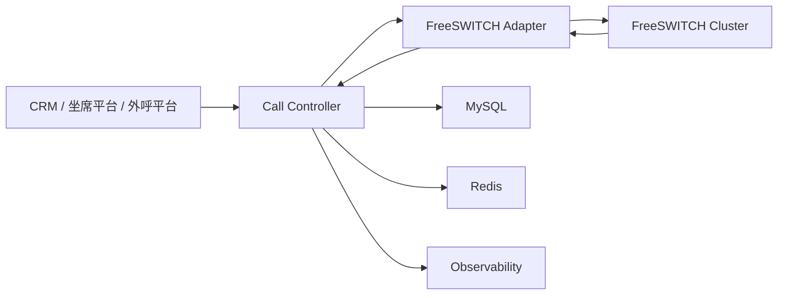

# 通话控制器改造设计稿

## 1. 文档目标

本文档用于指导当前 `chandler25-jdk17-freeswitch` 项目从 FreeSWITCH ESL demo 改造为可扩展的“通话控制器”服务。

目标不是替代 FreeSWITCH，而是在其上层建设一个稳定的控制面，统一提供：

- 北向通话控制 API
- 通话会话与分腿状态管理
- 事件归一化与状态机驱动
- 命令审计、追踪、超时和补偿
- 面向坐席、外呼、转接、录音等业务的可扩展能力

## 2. 当前项目基线

当前项目已经具备以下基础能力：

- 通过 REST 接口下发 ESL 指令，已实现双呼桥接和按分机挂断
- 监听 FreeSWITCH 事件并回写用户状态、网关状态、录音事件
- 使用 Spring Boot + MyBatis-Plus + MySQL 构建基础服务

当前项目也存在典型 demo 特征：

- 以 `user_status` 和 `gateway_status` 为主，缺少独立的通话会话模型
- 通话控制命令直接散落在 Controller 或 Listener 中
- 本地内存 `taskMap` 承载桥接上下文，无法支撑多节点
- 事件状态没有统一枚举和状态机，容易出现状态漂移
- 缺少命令审计、幂等、超时处理、补偿机制

## 3. 改造目标

### 3.1 核心目标

将项目升级为一个独立的“通话控制器”，负责：

- 管理一通业务呼叫从创建到结束的完整生命周期
- 接收北向业务命令并转换为 FreeSWITCH 控制动作
- 从 ESL 事件中恢复真实通话状态
- 对外暴露统一、稳定、可追踪的控制接口

### 3.2 非目标

本期不直接覆盖：

- SBC 功能
- 媒体转码
- 计费系统
- 报表 BI
- 复杂 IVR 编排平台

这些能力需要预留扩展点，但不作为首期必须交付项。

## 4. 推荐系统定位

建议将本项目定位为“控制面服务”，位于业务系统与 FreeSWITCH 之间：



职责边界如下：

- 业务系统负责“为什么打”和“对谁打”
- 通话控制器负责“怎么打、怎么控、怎么追踪”
- FreeSWITCH 负责媒体和底层信令执行

## 5. 总体架构设计

建议拆分为以下层次。

### 5.1 接口层

负责提供北向 REST API，接收入参并完成鉴权、幂等校验、参数校验。

建议新增模块职责：

- `CallCommandController`
- `CallQueryController`
- `AgentStateController`
- `GatewayQueryController`

### 5.2 应用层

负责业务编排，不直接拼接 ESL 命令。

建议服务：

- `CallCommandApplicationService`
- `CallLifecycleApplicationService`
- `TransferApplicationService`
- `RecordApplicationService`

核心职责：

- 创建会话
- 选择 FS 节点
- 下发命令
- 更新领域状态
- 发起超时任务
- 处理补偿逻辑

### 5.3 领域层

这是本次改造的重点。

建议建立明确的领域模型：

- `CallSession`
- `CallLeg`
- `CallCommand`
- `AgentEndpoint`
- `GatewayNode`

领域层只表达业务状态与规则，例如：

- 一通会话可以有多个 leg
- 双呼桥接必须在双方应答后才能进入 `BRIDGING`
- 保持中的通话不能重复保持
- 已结束会话不能再接收转接命令

### 5.4 基础设施层

负责外部系统适配。

建议组件：

- `FreeSwitchCommandGateway`
- `FreeSwitchEventSubscriber`
- `CallSessionRepository`
- `CallCommandRepository`
- `DistributedLockService`
- `OutboxPublisher`

## 6. 目录建议

建议将代码结构从“按技术类型平铺”升级为“按业务能力分包”。

```text
src/main/java/com/chandler/freeswitch/client/example
  /call
    /api
    /app
    /domain
    /infra
  /agent
    /api
    /app
    /domain
    /infra
  /gateway
    /api
    /app
    /domain
    /infra
  /shared
    /config
    /enums
    /exception
    /model
    /util
```

这样比当前 `controller/service/listener/domain` 平铺结构更适合持续扩展。

## 7. 核心领域模型

### 7.1 CallSession

表示一通业务会话，不等同于单条 FreeSWITCH 通道。

建议字段：

- `sessionId`
- `bizId`
- `requestId`
- `tenantId`
- `scenario`
- `direction`
- `caller`
- `callee`
- `fsNodeId`
- `state`
- `bridgeState`
- `recordState`
- `startTime`
- `answerTime`
- `bridgeTime`
- `endTime`
- `hangupCause`
- `failureCode`
- `failureReason`

### 7.2 CallLeg

表示一条实际腿。

建议字段：

- `legId`
- `sessionId`
- `legRole`
- `channelUuid`
- `otherLegUuid`
- `endpointType`
- `endpointValue`
- `direction`
- `state`
- `answerTime`
- `hangupTime`
- `hangupCause`
- `sipCode`
- `codec`
- `gatewayName`

### 7.3 CallCommand

表示一次北向控制命令。

建议字段：

- `commandId`
- `sessionId`
- `bizId`
- `commandType`
- `commandStatus`
- `requestPayload`
- `responsePayload`
- `fsNodeId`
- `executeAt`
- `finishedAt`
- `errorCode`
- `errorMessage`
- `operatorId`

### 7.4 AgentEndpoint

表示一个坐席或分机终端的实时状态快照。

建议字段：

- `agentId`
- `extension`
- `registerState`
- `callState`
- `currentSessionId`
- `currentChannelUuid`
- `networkIp`
- `userAgent`
- `lastSeenAt`

## 8. 状态机设计

### 8.1 会话状态

建议定义统一会话状态：

- `NEW`
- `DIALING`
- `RINGING`
- `EARLY_MEDIA`
- `ANSWERED`
- `BRIDGING`
- `BRIDGED`
- `HOLDING`
- `HELD`
- `TRANSFERRING`
- `RECORDING`
- `ENDING`
- `ENDED`
- `FAILED`

### 8.2 Leg 状态

- `CREATED`
- `ROUTING`
- `RINGING`
- `ANSWERED`
- `BRIDGED`
- `HELD`
- `UNBRIDGED`
- `HANGUP`
- `DESTROYED`

### 8.3 状态迁移原则

- 只允许事件驱动状态前进，不允许任意跳转
- 命令下发成功不等于会话成功，最终状态以 ESL 事件为准
- 会话状态由 leg 状态聚合得出
- 所有状态迁移都应带时间戳和原因

### 8.4 双呼桥接示例

```text
NEW
-> DIALING
-> RINGING
-> ANSWERED(一方或双方)
-> BRIDGING
-> BRIDGED
-> ENDING
-> ENDED
```

如果任一方振铃超时或拒接：

```text
NEW -> DIALING -> RINGING -> FAILED
```

## 9. 事件处理设计

### 9.1 事件分层

建议不要让监听器直接写业务表，而是做三层处理：

1. `Raw ESL Event`
2. `Normalized Domain Event`
3. `State Machine Transition`

示例归一化事件：

- `LegCreatedEvent`
- `LegRingingEvent`
- `LegAnsweredEvent`
- `LegBridgedEvent`
- `LegHangupEvent`
- `LegDestroyedEvent`
- `AgentRegisteredEvent`
- `AgentUnregisteredEvent`
- `GatewayStateChangedEvent`
- `RecordStartedEvent`
- `RecordStoppedEvent`

### 9.2 幂等要求

ESL 事件可能重复、乱序或并发到达，处理时必须保证：

- 按 `Unique-ID + Event-Name + Event-Date-Timestamp` 去重
- 对同一 `sessionId` 串行处理状态迁移
- 对“晚到事件”允许忽略或降级处理

### 9.3 事件路由建议

- 按 `channelUuid -> leg`
- 按 `bizId -> session`
- 按 `otherLegUuid` 关联桥接关系

## 10. 命令模型设计

### 10.1 首期建议支持的北向命令

- `makeCall`
- `doubleCall`
- `hangup`
- `hold`
- `unhold`
- `blindTransfer`
- `attendedTransfer`
- `startRecord`
- `stopRecord`
- `querySession`

### 10.2 命令执行原则

- 北向命令先落库，再执行
- 命令返回“受理结果”，不是最终通话结果
- 最终执行状态依赖 ESL 事件回补
- 命令需要带 `requestId` 以支持幂等

### 10.3 命令执行链

```text
API 请求
-> 参数校验
-> 幂等校验
-> 创建 CallCommand
-> 创建/更新 CallSession
-> 路由 FS 节点
-> 生成 ESL 命令
-> 调用 FreeSwitchCommandGateway
-> 回写受理结果
-> 等待事件驱动状态最终落地
```

## 11. 数据库设计建议

### 11.1 call_session

```sql
create table call_session (
  id bigint primary key auto_increment,
  session_id varchar(64) not null,
  biz_id varchar(64) not null,
  request_id varchar(64) default null,
  tenant_id varchar(64) default null,
  scenario varchar(32) not null,
  direction varchar(16) not null,
  caller varchar(64) default null,
  callee varchar(64) default null,
  fs_node_id varchar(64) default null,
  state varchar(32) not null,
  bridge_state varchar(32) default null,
  record_state varchar(32) default null,
  start_time datetime default null,
  answer_time datetime default null,
  bridge_time datetime default null,
  end_time datetime default null,
  hangup_cause varchar(64) default null,
  failure_code varchar(64) default null,
  failure_reason varchar(255) default null,
  create_time datetime not null,
  update_time datetime not null,
  deleted tinyint not null default 0,
  unique key uk_session_id (session_id),
  unique key uk_biz_id (biz_id),
  key idx_request_id (request_id),
  key idx_state (state),
  key idx_start_time (start_time)
);
```

### 11.2 call_leg

```sql
create table call_leg (
  id bigint primary key auto_increment,
  leg_id varchar(64) not null,
  session_id varchar(64) not null,
  leg_role varchar(32) not null,
  channel_uuid varchar(64) default null,
  other_leg_uuid varchar(64) default null,
  endpoint_type varchar(32) not null,
  endpoint_value varchar(128) not null,
  direction varchar(16) default null,
  state varchar(32) not null,
  answer_time datetime default null,
  hangup_time datetime default null,
  hangup_cause varchar(64) default null,
  sip_code varchar(16) default null,
  codec varchar(32) default null,
  gateway_name varchar(64) default null,
  create_time datetime not null,
  update_time datetime not null,
  deleted tinyint not null default 0,
  unique key uk_leg_id (leg_id),
  unique key uk_channel_uuid (channel_uuid),
  key idx_session_id (session_id),
  key idx_state (state)
);
```

### 11.3 call_command

```sql
create table call_command (
  id bigint primary key auto_increment,
  command_id varchar(64) not null,
  session_id varchar(64) default null,
  biz_id varchar(64) default null,
  request_id varchar(64) default null,
  command_type varchar(32) not null,
  command_status varchar(32) not null,
  request_payload json default null,
  response_payload json default null,
  fs_node_id varchar(64) default null,
  operator_id varchar(64) default null,
  execute_at datetime default null,
  finished_at datetime default null,
  error_code varchar(64) default null,
  error_message varchar(255) default null,
  create_time datetime not null,
  update_time datetime not null,
  deleted tinyint not null default 0,
  unique key uk_command_id (command_id),
  unique key uk_request_id_type (request_id, command_type),
  key idx_session_id (session_id),
  key idx_biz_id (biz_id)
);
```

### 11.4 call_event_log

建议保留原始事件表，用于追查问题。

```sql
create table call_event_log (
  id bigint primary key auto_increment,
  event_id varchar(128) not null,
  session_id varchar(64) default null,
  channel_uuid varchar(64) default null,
  event_name varchar(64) not null,
  event_subclass varchar(128) default null,
  event_timestamp bigint default null,
  raw_headers json not null,
  process_status varchar(32) not null,
  error_message varchar(255) default null,
  create_time datetime not null,
  unique key uk_event_id (event_id),
  key idx_session_id (session_id),
  key idx_channel_uuid (channel_uuid),
  key idx_event_name (event_name)
);
```

## 12. Redis 设计建议

建议 Redis 只用于实时协作和分布式控制，不作为最终事实来源。

推荐用途：

- `call:session:lock:{sessionId}` 用于串行状态迁移
- `call:command:idempotent:{requestId}` 用于命令幂等
- `call:agent:state:{extension}` 用于热点实时状态
- `call:bridge:context:{bizId}` 用于双呼临时桥接上下文

## 13. 北向 API 设计

### 13.1 发起双呼

`POST /api/v1/calls/double-call`

请求体：

```json
{
  "requestId": "req-20260428-0001",
  "bizId": "biz-20260428-0001",
  "scenario": "AGENT_CALLBACK",
  "caller": "1003",
  "callee": "1017",
  "timeoutSeconds": 30,
  "record": false
}
```

响应体：

```json
{
  "accepted": true,
  "sessionId": "sess-9a8b7c",
  "bizId": "biz-20260428-0001",
  "commandId": "cmd-f2d1e1",
  "state": "DIALING"
}
```

### 13.2 挂断

`POST /api/v1/calls/{sessionId}/hangup`

### 13.3 保持

`POST /api/v1/calls/{sessionId}/hold`

### 13.4 取消保持

`POST /api/v1/calls/{sessionId}/unhold`

### 13.5 盲转

`POST /api/v1/calls/{sessionId}/blind-transfer`

### 13.6 咨询转

`POST /api/v1/calls/{sessionId}/attended-transfer`

### 13.7 开始录音

`POST /api/v1/calls/{sessionId}/record/start`

### 13.8 停止录音

`POST /api/v1/calls/{sessionId}/record/stop`

### 13.9 查询会话

`GET /api/v1/calls/{sessionId}`

### 13.10 查询会话时间线

`GET /api/v1/calls/{sessionId}/timeline`

## 14. 对 FreeSWITCH 的适配建议

### 14.1 统一命令网关

所有 ESL 命令拼接应收口到 `FreeSwitchCommandGateway`，不要散落在 Controller 中。

建议提供方法：

- `originateCall`
- `bridge`
- `kill`
- `hold`
- `unhold`
- `transfer`
- `startRecord`
- `stopRecord`

### 14.2 节点路由

如果后续是多台 FreeSWITCH，建议引入 `fs_node` 配置表。

路由策略首期可简单实现：

- 优先同租户固定节点
- 其次按在线状态选择
- 再按当前通话数最少选择

### 14.3 配置化

以下内容必须配置化，不应写死：

- ESL 地址
- 默认超时时间
- 录音目录
- 是否自动录音
- 事件订阅清单

## 15. 观测性设计

### 15.1 日志

日志必须统一携带：

- `requestId`
- `bizId`
- `sessionId`
- `commandId`
- `channelUuid`

### 15.2 指标

建议输出：

- 呼叫创建数
- 呼叫接通率
- 振铃超时数
- 平均接通时长
- 平均通话时长
- 命令失败数
- ESL 事件消费延迟

### 15.3 链路追踪

如果后续接入 OpenTelemetry，可按一次命令请求贯通到事件回写。

## 16. 安全与治理

建议首期至少加入：

- API 鉴权
- 租户隔离字段
- 操作人审计
- 命令白名单
- 频率限制

## 17. 兼容当前代码的改造映射

### 17.1 保留项

以下代码可保留并逐步迁移：

- ESL 监听能力
- `InboundClient` 接入方式
- MyBatis-Plus 基础设施
- 用户注册和网关状态监听逻辑

### 17.2 重构项

建议优先重构以下部分：

- 现有 `CallController` 改造成命令入口，不再直接拼接业务逻辑
- 现有 `CallBridgeListener` 改为“事件聚合器 + 状态机触发器”
- 现有 `CallStatusEventListener` 改为“原始事件归一化层”
- `UserStatus` 改成“终端快照模型”，不再承担通话事实表职责

## 18. 分阶段实施计划

### 阶段一：控制器骨架

目标：

- 补齐 `call_session`、`call_leg`、`call_command`、`call_event_log`
- 抽出 `FreeSwitchCommandGateway`
- 统一状态枚举
- 增加 `CallCommandController`

交付：

- 能创建双呼会话
- 能根据 `sessionId` 查询会话状态
- 能落完整命令和事件日志

### 阶段二：状态机闭环

目标：

- 事件归一化
- 会话状态机
- 幂等和乱序处理
- 会话时间线查询

交付：

- 会话状态与 FreeSWITCH 实际状态基本一致
- 能回放一次通话全过程

### 阶段三：增强控制能力

目标：

- 挂断
- 保持/取消保持
- 盲转
- 咨询转
- 录音控制

交付：

- 控制器具备最小生产可用能力

### 阶段四：生产化

目标：

- Redis 分布式锁
- 多节点 FreeSWITCH 路由
- 告警和指标
- 灰度和限流

交付：

- 支撑多实例部署和基础生产运维

## 19. 首期编码建议

如果以当前仓库为基础开始动工，建议优先做下面这些具体开发任务：

1. 增加统一枚举：`CallSessionState`、`CallLegState`、`CallCommandType`、`CallCommandStatus`
2. 增加实体：`CallSessionDO`、`CallLegDO`、`CallCommandDO`、`CallEventLogDO`
3. 增加接口：`/api/v1/calls/double-call`、`/api/v1/calls/{sessionId}`、`/api/v1/calls/{sessionId}/hangup`
4. 提取网关：`FreeSwitchCommandGateway`
5. 改造监听器：先记录原始事件，再驱动会话更新
6. 将当前本地 `taskMap` 替换为 DB + Redis 组合上下文
7. 统一日志上下文和错误码

## 20. 风险与注意事项

- FreeSWITCH 事件存在重复和乱序，状态机必须容错
- 双呼场景里“一方应答、一方未应答”的边界要单独处理
- 仅靠 `user_status` 无法支撑多并发通话和历史追踪
- 本地内存状态不能作为真实来源
- 命令执行结果不能以同步接口返回值为准，必须依赖事件闭环

## 21. 结论

当前项目非常适合继续演进为通话控制器，因为底层 ESL 接入和部分事件监听已经具备。改造的关键不在于再加几个 Controller，而在于补齐“会话模型、状态机、命令审计、事件归一化、分布式上下文”这五个控制器核心能力。

建议先完成“会话模型 + 命令模型 + 查询接口 + 状态机骨架”，再逐步扩展到保持、转接、录音和多节点路由。这条路径风险最低，也最容易在当前代码基础上平滑落地。
